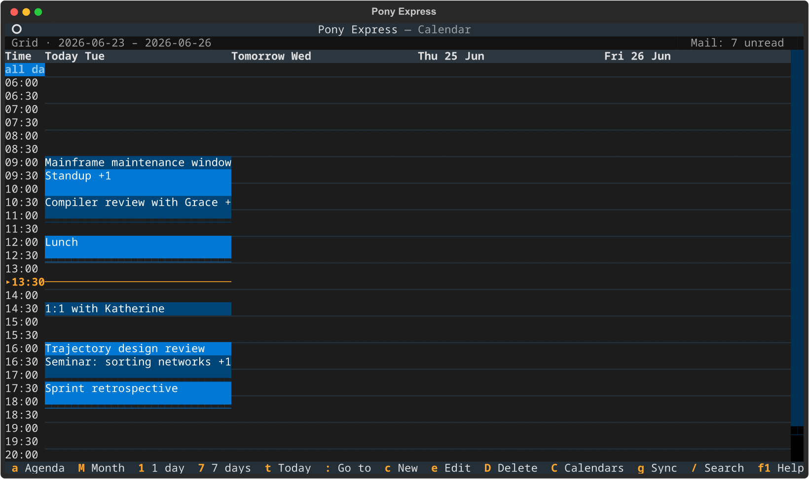
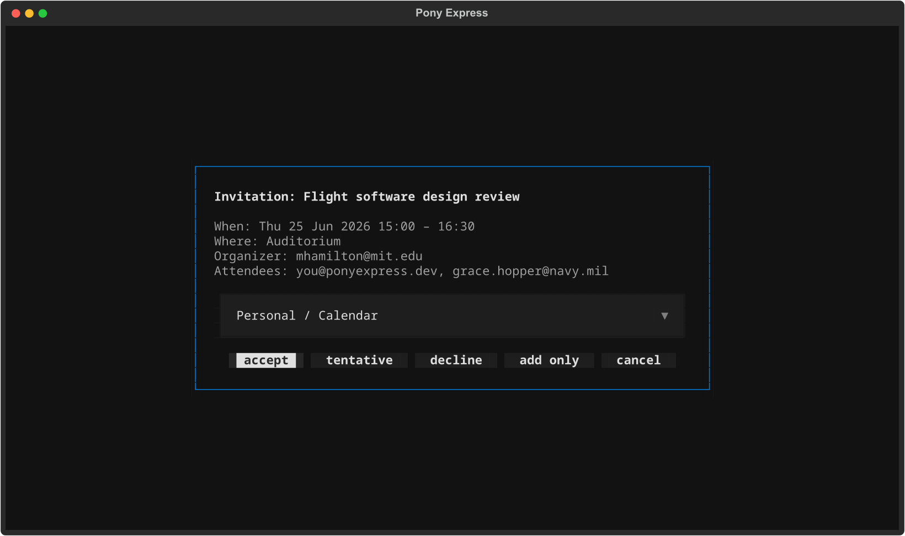

# Calendar

Pony Express is a calendar as well as a mail client, and the two are one
program: one process, one configuration file, one place where things are
announced. Press ++f2++ in the TUI and the agenda comes to the front;
press ++f2++ again and the mail reader is back with the same folder, the
same cursor row and the same scroll position you left it on.



Events are synchronised with a CalDAV server, mirrored on disk as
ordinary `.ics` files and indexed in SQLite. The local files are the
authoritative copy: everything you can see in the views, search and
answer works with the network down, and the next sync reconciles it.

---

## Adding a calendar account

The calendar's settings live under `[calendar]` in the same
`config.toml` the mail side uses, with one `[[calendar.accounts]]` table
per CalDAV account. Open the file with `pony config edit`.

### A server that takes a password

Nextcloud, Radicale, Baïkal, Apple Calendar and most self-hosted servers
authenticate with a username and a password:

```toml
[calendar]
background_sync_interval_seconds = 3600

[[calendar.accounts]]
name = "personal"
url = "https://caldav.example.com/dav/principals/user@example.com/"
username = "user@example.com"
credential = { backend = "env", variable = "PONY_PERSONAL_CALDAV_PASSWORD" }
```

`url` is the principal URL; the calendars under it are discovered on the
first sync, so you do not list them.

The example reads the password from an environment variable you name.
It can also come from a command — `{ backend = "command", command =
["pass", "show", "caldav/personal"] }` — or, if you must, sit in the file
as `{ backend = "plaintext", password = "…" }`. The full list is under
[Configuration](configuration.md#calendar-credential-backends). Note that
a calendar account spells its credential as an inline table, which is not
the shape a mail account uses.

### Google, and anything else that wants OAuth

Google Calendar needs OAuth rather than a password. Create an OAuth
client of type **Desktop app** in a Google Cloud project, then:

```toml
[[calendar.accounts]]
name = "google"
credential = { backend = "google", client_id = "12345.apps.googleusercontent.com", client_secret = "GOCSPX-..." }
```

The `google` backend fills in the CalDAV URL, the username and the scope,
so those three lines are the whole account. For a non-Google provider use
`backend = "oauth"` and give `url`, `username`, `client_id`,
`client_secret` and the provider's `scope`.

Nothing happens until the first sync needs the account. At that moment:

1. A browser window opens on the provider's consent page, while the
   calendar listens on a loopback port of its own choosing.
2. You approve, the provider redirects back to that port, and the tokens
   are written under the calendar's data directory — never into
   `config.toml`.
3. The sync continues. Afterwards the refresh token is used silently; you
   are only asked again if it is revoked.

Inside the TUI this runs as a dialog on top of whatever you were doing.
From the command line, run `pony calendar sync` in a terminal and follow
the same flow.

!!! tip "No browser on this machine"
    Over SSH, or on a host with no graphical browser, the flow switches
    to printing the URL and asking you to paste back the address you were
    redirected to. It decides by looking at `DISPLAY` / `WAYLAND_DISPLAY`
    and at `BROWSER`; set `CHRONOS_OAUTH_FLOW=remote-browser` to force
    the paste form, or `CHRONOS_OAUTH_FLOW=browser` to force the local
    one.

### Choosing which calendars to sync

Every calendar the server advertises is synced by default. Three
per-account lists of Python regular expressions, matched against the
calendar's display name with `re.fullmatch`, narrow that:

| Key | Effect |
|---|---|
| `include` | Only these calendars are synced. Default `[".*"]`. |
| `exclude` | Dropped after `include` is applied. |
| `read_only` | Synced server-to-local only. Nothing is ever uploaded from one of these, and a local change is undone when the server's copy is next fetched. |

`read_only` is the right setting for a subscribed feed — a holiday
calendar, a colleague's shared diary — that you want to see but never
write to.

### What ends up on your disk

| What | Where |
|---|---|
| `.ics` mirror | `<calendar data dir>/mirror/<account>/<calendar>/` — one file per event |
| Index, recurrence and alarm caches | `<calendar data dir>/index.sqlite3` |
| OAuth tokens | `<calendar data dir>/tokens/<account>.json` |

The calendar data directory is `~/.local/share/chronos/` on Linux,
`~/Library/Application Support/chronos/` on macOS and
`%APPDATA%\chronos\` on Windows. It is deliberately separate from the
mail data directory, so a calendar that was already in use keeps
everything it had synced when Pony Express became its front end. Only
the configuration file is shared.

The mirror is a plain directory of `.ics` files. Reading them with
another tool, backing them up or grepping them is expected; the index is
a cache that can be rebuilt from them.

---

## Moving around

### The four views

| Key | View | Shows |
|---|---|---|
| ++a++ | Agenda | A list of entries over a day, a week or a month, with the highlighted one's details underneath |
| ++1++ | Day | One day on a time grid, half an hour per row |
| ++2++ … ++7++ | Grid | That many days side by side on the same grid |
| ++shift+m++ | Month | A Monday-to-Sunday month grid, a few entries per cell and `+N more` for the rest |

The grid keeps the width you chose for as long as the program runs, so
leaving it for the agenda and coming back shows the same days. Which of
the four views you were last in is remembered across sessions; the agenda
opens on its week window.

!!! note "Case matters"
    The calendar uses both cases of several letters, and this page writes
    the capital as ++shift+m++, ++shift+c++, ++shift+d++, ++shift+g++ and
    ++shift+q++. The bare capital works too — both are bound, because
    terminals disagree about which one they send.

The time grid runs from 06:00 to 22:00 and widens by itself when
something falls outside that, so an early flight or a late concert is
never hidden. Entries that have no time of day — all-day events, and
tasks (`VTODO`) arriving from the server — sit in an **all day** banner
row above the grid.

Inside the agenda, ++d++, ++w++ and ++m++ switch the window between one
day, the calendar week (Monday to Sunday) and the calendar month. They do
nothing in the other views.

### Dates

| Key | Moves |
|---|---|
| ++t++ | To today |
| ++n++ / ++p++ | One step forward or back, where a step is what the view is made of: a day in Day and Grid, a calendar month in Month, and the window size in the Agenda |
| ++shift+n++ / ++shift+p++ | One week, in every view |
| ++shift+g++ | Opens the *go to date* dialog — the capital that goes to a folder in the mail reader |
| ++colon++ | The same dialog, the vim way |

The dialog takes more than a date. `2026-10-15` is the obvious form;
`15` is the 15th of the month you are looking at; `fri` (any unambiguous
prefix of at least two letters) is the next Friday after it; `+2w`,
`-3d`, `+1m` and `+1y` are relative to it; `today` or `t` comes home.

In the month grid, moving the cursor off the month you are looking at
flips to the neighbouring one, and ++enter++ on a day opens it in the
Day view.

### Showing fewer calendars

++shift+c++ opens the calendar tree on the left, grouped by
account. ++enter++ ticks or unticks the calendar under the cursor and
the views redraw at once. The panel is hidden until you ask for it,
because the agenda already shows everything.

With nothing ticked, every calendar is shown. That is also what you get
by unticking the last one, which is the gentlest way back from "I have
hidden too much".

### Searching

++slash++ opens a search box that filters as you type across the summary,
description and location of your events. ++enter++ opens the highlighted
result; ++escape++ closes the box. The search covers what is on your
disk, not a date window, so an event two years out is as findable as
tomorrow's — and it covers every calendar, including the ones the filter
panel is currently hiding. Trashed entries are left out.

---

## Working with events

### Creating one

++c++ opens the event form. Where it starts depends on where you were:
on a time grid, the half-hour cell under the cursor; in the month grid,
09:00 on the day under the cursor; in the agenda, the next half hour from
now. The default length is one hour.

The form asks for a calendar, a summary, start and end, a location, a
description, invitees and reminders. ++ctrl+s++ saves, ++escape++
abandons. Only the summary and the start are required — leave the end
empty for an event with no stated length.

Saving writes the `.ics` file and the index row immediately, so the event
is on screen (and in your backups) before the server has heard of it. The
next sync uploads it.

### With the mouse

On the Day and Grid views the mouse does the obvious things:

- **Drag across empty cells** to create an event covering them, then fill
  in the form that opens.
- **Drag across the all-day banner** to create an all-day event spanning
  the days you covered.
- **Click an event** to open its details.
- **Drag an event** to another time or another day to reschedule it. The
  move is saved as you drop it and reported in a toast.

!!! info "What cannot be dragged"
    Dragging refuses a recurring event — moving one occurrence means
    writing a `RECURRENCE-ID` override, and moving the series changes
    what the rule means, neither of which should happen because a mouse
    slipped. All-day events cannot be dragged onto the time grid either.
    Both say so rather than doing something approximate.

### Reading and editing

++enter++ opens the entry under the cursor: summary, calendar, location,
start, end, status, attendees, reminders and the full notes, which scroll
if they run past the dialog. ++e++ from there (or from any view) opens
the same form the event was created with; ++ctrl+d++ inside the form
deletes the event being edited.

### All-day events

Tick **All day** in the form and the time selectors grey out. The *Ends*
field then holds the **last day** of the event, inclusive — an event on
the 3rd and 4th is entered as 3rd to 4th, not 3rd to 5th. It is written
as a date-valued event, which is what other calendar clients expect.

### Reminders

The **Reminders** field takes a comma-separated list of minutes before
the start: `15, 60` fires a quarter of an hour and an hour ahead. A
reminder falling due is announced wherever you are looking — in the
agenda, or in the middle of a message — as a toast, a terminal bell and a
desktop notification asked for through the terminal itself, so it arrives
on the machine in front of you rather than at the far end of an SSH
session. Reminders are checked every thirty seconds, and each is recorded
once it has fired, so restarting does not replay it.

Alarms set by another client still work: a trigger anchored to the end of
an event, or at an absolute time, is shown in the detail pane and fires
like any other. Display and audio alarms are the two kinds honoured;
anything else in the file is ignored.

!!! warning "Editing an event rewrites its reminders"
    The field can only express "N minutes before the start", so that is
    what it shows and that is what it saves. Reminders it could not
    represent are not in the field, and saving the form therefore drops
    them.

### Recurring events

A recurring event synced from the server is expanded locally: `RRULE`,
`RDATE` and `EXDATE` are all honoured, single-occurrence overrides
replace the instance they belong to, and an endless series is expanded
only as far as the window you are looking at. Every occurrence appears in
the views in its own right.

!!! warning "The form has no recurrence field"
    You cannot create a repeating event here, and saving a recurring
    event through the form rewrites it as a single event without its
    rule. Open a series in the client that owns it, or edit the `.ics`
    file in the mirror and let the next sync push it.

### Deleting, and the trash

++shift+d++ asks for confirmation and then marks the event trashed.
It leaves every view at once but is not gone: the row and its mirror file
stay until the next sync, which issues the delete on the server and only
then purges both. An event the server never saw is simply removed
locally. Nothing is deleted behind a failed network call, so an
unreachable server means the delete waits rather than diverging.

In a `read_only` calendar nothing is pushed, so the event only disappears
locally: it comes back the next time the server's copy of it is fetched.

A delete the server keeps refusing would otherwise leave the row in the
index for ever, invisible but present. `trash_retention_days` (30 by
default) is the backstop: once a trashed event has waited that long, it
and its mirror file are dropped locally with no further attempt.

---

## Invitations

### One that arrives in your mail

A message carrying a `text/calendar` part is shown as an invitation above
its body, and ++i++ in the reader opens the reply dialog.



Choose the calendar it should go in, then ++a++ to accept, ++t++ for
tentative, ++d++ to decline, or *add only* to file it without telling
anyone. Accepting files the event and then mails the organizer a reply;
the two are reported separately, so an event that was filed but whose
reply could not be sent says exactly that instead of claiming success. A
cancellation removes the event again, and a re-sent invitation updates
the one already filed. See [Terminal UI](tui.md#invitations) for the
reader's side of this.

### One you are sending

Put addresses in the **Invitees** field of the event form and saving the
event also mails them an invitation — a proper `METHOD:REQUEST`, with the
event's title after `Invitation:` in the subject line. Editing the event
later sends the same people an update. It goes out over SMTP from the
first mail account configured to send; the `ORGANIZER` recorded in the
event is the calendar account's username, when that is an address, and
that address is left out of the recipients.

Addresses complete from your contacts as you type — the same index the
composer's address fields use, which is most of the point of mail and
calendar sharing a process. Type at least two characters and press
++right++ to accept the suggestion. ++shift+b++ opens the contact browser
itself, the same key and the same list as in the mail reader; running the
calendar on its own there is no contact store, and it says so rather than
appearing to do nothing.

The event is saved first and mailed second, so a send that fails costs
you the invitation, never the event; it is reported as a failure to post,
with the event already safely in the calendar.

!!! note "What is not supported"
    Replies come back as ordinary mail. Pony Express does not track
    per-attendee acceptance on the organizer's copy of the event, and
    counter-proposals and free/busy lookups are out of scope.

---

## Keeping in sync

### When it runs

Every calendar account is synced on a background thread the application
owns, so the cadence does not depend on which half of the program is on
screen — the agenda does not have to be open, and the countdown does not
restart because you looked at your mail. It is on by default, once an
hour:

```toml
[calendar]
background_sync_enabled = true
background_sync_interval_seconds = 3600
```

The first automatic run falls one interval after startup, never at it.
Mail is on its own thread with its own, separate settings at the top
level of the file (off by default, every 600 seconds) — see
[Synchronization](synchronization.md).

### Syncing now

The two halves use the same two keys for this, so neither has to be
learned twice.

++ctrl+g++ syncs in the background and says nothing until it is done. It
restarts the countdown, so the next automatic run is a full interval
away. With `background_sync_enabled = false` it syncs once and starts no
cadence: pressing a key is not permission to sync hourly from now on.

++g++ takes the longer road — a confirmation listing the accounts, then a
progress screen with a live log — for when you want to watch. The capital
is not a third way to sync: ++shift+g++ goes to a date, as it goes to a
folder in the mail reader.

A sync you asked for always reports its result. A periodic one stays
quiet unless something changed or something failed.

### The countdown in the title row

The right-hand end of the agenda's title row shows the state of the
background sync:

```
 Grid · 2026-10-05 – 2026-10-08              Mail: 2 unread   ◷ 59:30
```

`◷ 59:30` is the time left until the next scheduled sync, rounded down to
the half minute — it never claims precision it has not got. While a sync
is running a spinner replaces it, because when the *next* one is due is
not what you want to read then. The line is blank when no periodic sync
is scheduled, which is what `background_sync_enabled = false` looks like.

Beside it, the agenda carries the unread mail count, and the mail reader
carries the next event, so each half says one line about the other.
Neither line appears when there is nothing to say.

### When the same event changed in both places

Your edit is uploaded only if the server's copy is still the one you
started from. If it changed underneath, the upload is held back rather
than forced through, and the sync says so:

```
work: Design review changed on the server too; local edit not uploaded
```

The next sync that fetches the event then has to decide between two
versions, and it decides the way the organiser's own numbering says to:
the higher `SEQUENCE` wins, a tie goes to the later `LAST-MODIFIED`, and
if neither separates them the server's copy wins, because something has
to break the tie and that is the copy everyone else can see.

Either way you are told which way it went, and the message names the
event:

```
work: 'Design review' changed here and on the server; your version was
kept and will be uploaded
work: 'Design review' changed here and on the server; the server's
version was kept
```

When your version wins it is uploaded on that same sync. When the
server's wins, your edit is gone from the local copy — so treat the
notice as a prompt to check the event. The mirror is plain `.ics` files,
so a version you want back can usually be recovered from a backup of it
with `cp`.

Two more guards worth knowing:

- If more than a fifth of a calendar's events have vanished from the
  server, the sync stops for that calendar rather than deleting them
  locally, and reports how many were missing. That ratio is almost always
  a server or configuration problem, not a real deletion; the log holds a
  sample of the paths that did not line up.
- Two syncs never run against the same database at once. A
  `pony calendar sync` started while the TUI is syncing exits with a
  message naming the process that holds the lock.

### When something will not upload

The sync summary names it, as a toast in the TUI and on stderr from the
command line. The usual causes:

| What it says | What happened |
|---|---|
| `… changed on the server too; local edit not uploaded` | Both sides edited it; see above. |
| `… exists on the server with different content; not uploaded` | Something else created an event with the same UID. The next full sync pulls the server's version. |
| `… could not upload …` with a server message | Network or server error. It is retried on every sync until it succeeds. |

A failed upload is never silently dropped: the event keeps its pending
mark and is attempted again on every sync. If an edit of yours never
leaves at all, check that its calendar is not listed in `read_only` —
nothing is uploaded from those, by design.

Run `pony calendar doctor` for a check of the local state, or
`pony calendar doctor --remote` to add redacted probes against the
server. `pony calendar sync --force` makes the next run re-fetch
everything, which is the way out of a stale cache.

### Importing an `.ics` file

```
pony calendar import invite.ics
pony calendar import ~/Downloads --account personal --calendar work
```

Directories are walked for `*.ics` files, one level deep. The target
account and calendar are asked for if you do not pass them. An import
honours what the file says it is: a cancellation removes the event, a
re-sent request updates it. When a UID already exists and the file is not
a newer version of it, `--on-conflict` decides — `skip` (the default),
`replace` or `rename` into a fresh UID. The account is synced afterwards
unless you pass `--no-sync`.

`pony calendar invite.ics` opens the calendar on its own with an import
dialog for that file, which asks for the target calendar and offers *add*
or *add+sync*.

---

## Keyboard reference

Every key of the calendar's main screen. The footer carries the common
ones and ++f1++ shows the whole list in the program itself. Keys written
here as ++shift+x++ also work as the bare capital: both are bound,
because terminals disagree about which one they send.

!!! tip "The keys both halves share"
    One program, one set of reflexes. ++ctrl+g++ syncs in the background
    and ++g++ opens the sync dialog, in the mail reader and in the agenda
    alike. ++shift+g++ goes somewhere — to a folder in the mail reader, to
    a date here. ++shift+b++ browses the same contacts from either side,
    and ++shift+q++ quits from either side.

| Key | Action |
|---|---|
| ++a++ | Agenda view |
| ++shift+m++ | Month view |
| ++1++ | Single-day timeline |
| ++2++ … ++7++ | Multi-day grid, that many days wide |
| ++d++ | Agenda window: one day *(agenda only)* |
| ++w++ | Agenda window: one week *(agenda only)* |
| ++m++ | Agenda window: one month *(agenda only)* |
| ++t++ | Jump to today |
| ++shift+g++ / ++colon++ | Go to a date |
| ++n++ / ++p++ | Next / previous, by the view's own unit |
| ++shift+n++ / ++shift+p++ | Next / previous week, in any view |
| ++c++ | New event |
| ++e++ | Edit the highlighted event |
| ++enter++ | Open the highlighted event |
| ++shift+d++ | Delete the highlighted event, after confirmation |
| ++shift+c++ | Show or hide the calendar filter panel |
| ++ctrl+g++ | Sync now, in the background, quietly |
| ++g++ | Sync with the confirmation and progress dialogs |
| ++shift+b++ | Browse contacts (needs the mail side's contact store) |
| ++slash++ | Search |
| ++f1++ | Keyboard help |
| ++shift+q++ | Quit |

In the event form:

| Key | Action |
|---|---|
| ++ctrl+s++ | Save |
| ++ctrl+d++ | Delete this event *(only when editing an existing one)* |
| ++escape++ | Cancel |

In the event detail dialog, ++e++ edits and ++escape++ closes. In the
search box, ++enter++ opens the highlighted result and ++escape++
cancels.

++f2++ belongs to Pony Express rather than to the calendar, and swaps the
two halves from either side.

---

## From the command line

Everything after `pony calendar` belongs to the calendar's own parser, so
its help is the real help:

```
pony calendar --help
pony calendar sync
pony calendar list --since 2026-03-01 --until 2026-04-01
```

See the [CLI Reference](cli.md#pony-calendar) for the full list of
subcommands.
