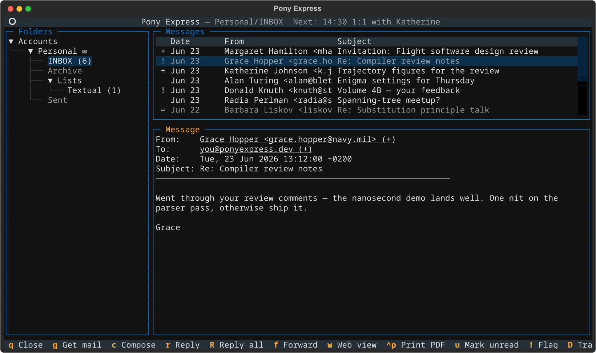
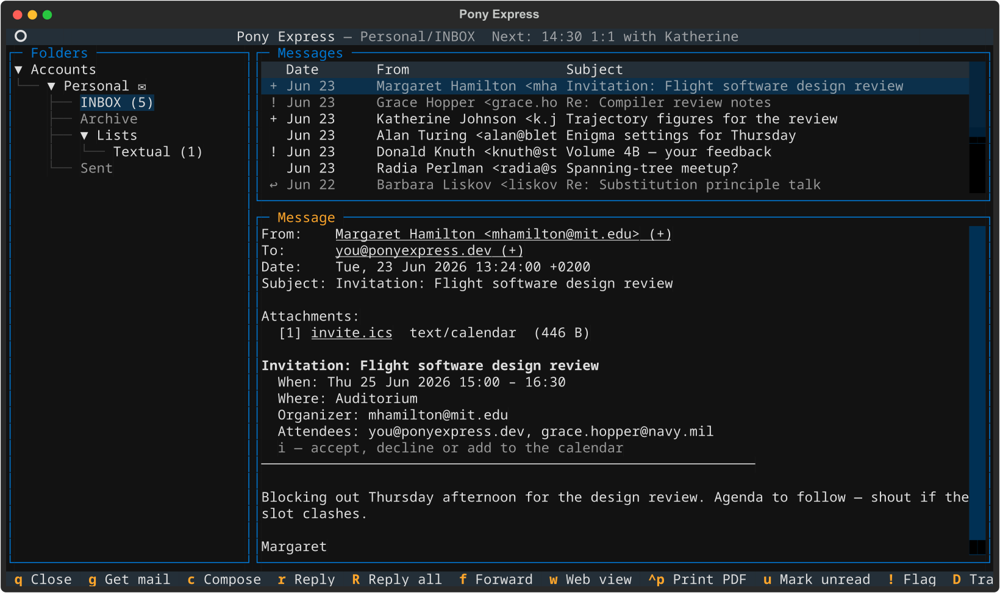
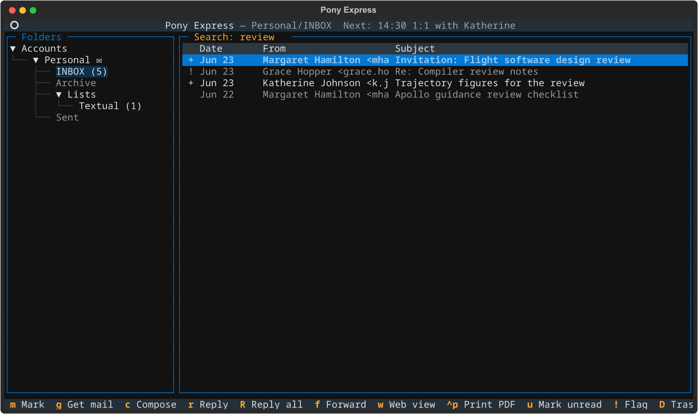

# Terminal UI

Launch the TUI with `pony tui`. Press ++q++ to quit at any time.



## Layout

The TUI is a three-pane layout. All accounts are visible simultaneously; the
folder list on the left is collapsible per account.

```
 Pony Express                                                           Mail
+------------------------+-----------------------------------------------------+
| > Personal             |  From              Subject               Date    Sz  |
|   > INBOX  (3 unread)  | --------------------------------------------------- |
|     Sent Mail          | * Alice Smith      Re: Project update    Apr 11   4K |
|     Drafts             |   Bob Jones        Meeting tomorrow      Apr 10   2K |
|     Archive            |   no-reply@ex.com  Your order shipped    Apr 09   8K |
|                        |                                                      |
| > Work                 | --------------------------------------------------- |
|   > INBOX (12 unread)  |  From:    Alice Smith <alice@example.com>            |
|     Sent Items         |  To:      jane@example.com                           |
|     Projects           |  Date:    Sat, 11 Apr 2026 14:32 +0200              |
|     Projects/Alpha     |  Subject: Re: Project update                         |
|     Archive            |                                                      |
|                        |  Hi Jane,                                            |
| > Archive              |                                                      |
|   > INBOX  (0 unread)  |  Thanks for the update! The timeline looks good.     |
|     2024               |  I'll book the conference room for Tuesday.          |
|     2025               |                                                      |
|                        |  Best,                                               |
|                        |  Alice                                               |
+------------------------+-----------------------------------------------------+
 Q Quit  g Get mail  c Compose  r Reply  f Forward  D Trash  B Contacts
```

| Pane | Description |
|---|---|
| **Left** | Folder list grouped by account, with unread counts. Selecting a folder loads its messages in the top-right pane. |
| **Top-right** | Message list for the selected folder, sorted newest-first. An unread indicator appears in the icon column. |
| **Bottom-right** | Message preview. Renders `text/plain`; HTML-only messages have `<style>`, `<script>`, and tags stripped for a clean reading experience. |

### Screen-specific keybindings

Each screen in the TUI shows only its own relevant keybindings in the footer
bar. Mail-reader bindings (sync, compose, flags) appear only in the main
reader. The contacts browser and compose screens show only their own
keybindings, so pressing mail keys like `g` or `D` inside the contacts browser
does nothing.

---

## Navigation

### Folder pane

| Key | Action |
|---|---|
| ++n++ | Move to next folder |
| ++p++ | Move to previous folder |
| ++shift+n++ | Jump to next account's INBOX |
| ++shift+p++ | Jump to previous account's INBOX |
| ++shift+g++ | Goto-folder dialog: fuzzy-search every account/folder pair |
| ++f1++ | Show the keybinding cheatsheet (centered modal) |
| ++f2++ | Switch between mail and the calendar |

### Message list

| Key | Action |
|---|---|
| ++n++ | Move to next message |
| ++p++ | Move to previous message |
| ++less++ | Jump to first message |
| ++greater++ | Jump to last message |
| ++m++ | Mark the current row and move down (marked rows become the target of flag, move and copy actions) |
| ++shift+down++ / ++shift+up++ | Mark and move without leaving the keyboard home row |
| ++enter++ | Open message in the preview pane |

### Message preview

When the message view is focused (after opening a message):

| Key | Action |
|---|---|
| ++q++ / ++escape++ | Close preview, return focus to message list |
| ++n++ | Load next message |
| ++p++ | Load previous message |
| ++space++ / ++page-down++ | Scroll down one page (or advance to next unread at bottom) |
| ++less++ | Scroll to top |
| ++greater++ | Scroll to bottom |
| ++i++ | Answer the invitation on this message |

---

## The calendar

++f2++ puts the agenda in front of the mail reader; ++f2++ again brings the
mail back, with the folder, cursor row and scroll position exactly as they
were. It is one program: the same process, the same configuration file, and
one place reminders and new mail are announced.


Without a `[calendar]` table in `config.toml`, ++f2++ says so and nothing
else changes. See [Configuration](configuration.md#calendar) for the
settings and `pony calendar --help` for the command-line side.

While the mail reader is open, the header carries the next event beside the
open folder:

```
 Pony Express — work/INBOX  Next: 10:45 Team standup
```

While the agenda is open, its title row carries the unread mail count beside
the sync countdown:

```
 Grid · 2026-10-05 – 2026-10-08              Mail: 2 unread   ◷ 59:30
```

Neither line appears when there is nothing to say.

### Reminders and new mail

A calendar reminder falling due is announced wherever you are — in the
agenda or in the middle of reading mail — as a toast, a terminal bell and a
desktop notification. The notification is asked for through the terminal
(OSC 777), which is what makes it arrive on the machine you are looking at
rather than on the far end of an SSH session; terminals without support
ignore it.

Mail that a sync has just fetched is announced the same way, but only while
the agenda is in front of you: the mail reader already reports its own sync
results, and a second toast saying the same thing would be noise.

The calendar keeps syncing in the background while you read mail, on the
interval from `background_sync_interval_seconds`, so a reminder for
something added on another device still arrives. It says nothing unless it
fails, and then only to the log.

### Invitations

A message carrying an invitation shows what it proposes above its body:

```
 Invitation: Design review
   When: Wed 07 Oct 2026 10:10 - 11:10
   Where: Room 3
   Organizer: bob@example.com
   Attendees: you@example.com, ana@example.com
   i — accept, decline or add to the calendar
```



++i++ opens a dialog that asks which calendar it goes in and what the
organizer is told — ++a++ accept, ++t++ tentative, ++d++ decline, or *add
only* to file it without answering. Accepting files the event and then mails
a reply; the two are reported separately, so an event that was filed but
whose reply could not be sent says so rather than claiming success.


A cancellation (`METHOD:CANCEL`) removes the event instead, and a re-sent
invitation updates the one already filed.

Going the other way, saving an event that has attendees mails it to them as
an invitation. The event is saved first, so a send failure never costs you
the event. Attendee addresses complete from the same contact index the
composer uses.

---

## Flag operations

Flag changes are applied immediately to the local index and pushed to the
server on the next sync. They are also written onto the message in the local
mirror — as the filename suffix for Maildir, as the `Status` / `X-Status`
headers for mbox — so another mail client reading the same tree sees the same
read, flagged and answered state.

| Key | Action |
|---|---|
| ++u++ | Mark current message as unread |
| ++shift+c++ | Mark every message in the current folder as read |
| ++exclam++ | Toggle the starred/flagged flag |
| ++shift+d++ | Move to trash (sets `local_status = trashed`; pushed to server on next sync) |
| ++shift+a++ | Archive to the account's `archive_folder` (local move; pushed to server on next sync) |
| ++shift+y++ | Copy the current message to another folder |
| ++shift+m++ | Move the current message to another folder |
| ++shift+n++ | Create a new folder in the current account's local mirror (server-side `CREATE` issued on next sync) |

Opening a message marks it read; there is no separate key for that.

!!! info "Trash vs. delete"
    `D` marks the message for deletion locally. It stays in the local mirror
    until the next sync, when Pony sends an EXPUNGE to the server and purges
    the local copy. In a read-only folder, `D` is a no-op that self-corrects
    on the next sync.

!!! info "Archive"
    `A` requires `archive_folder = "..."` on the account. The selected message
    moves into that folder immediately in the mirror and the index; the next
    sync executes `UID MOVE` on the server (or `COPY` + `EXPUNGE` on servers
    that don't support RFC 6851). Archiving is refused when the source or
    target folder is read-only or excluded from sync.

!!! info "New folder"
    `N` opens a one-line input for a folder name. The folder is created
    immediately in the account's local mirror (Maildir directory or mbox
    file). For IMAP accounts the next sync compares local mirror folders
    against server folders and issues `IMAP CREATE` for any folder that
    exists only locally, so the freshly-created folder appears on the
    server too. For local accounts the folder is created locally only —
    there is nothing to push.

---

## Sync from the TUI

Press ++g++ to start a sync without leaving the TUI.

1. Pony computes the sync plan, showing a progress bar during the planning
   phase as it scans each folder:

    ```
    +------------------ Planning sync... ------------------+
    | Scanning Personal/INBOX...                           |
    | [==================>                   ]  45%         |
    +------------------------------------------------------+
    ```

2. Once planning completes, a confirmation screen shows the plan:

    ```
    +------------------- Sync Plan -----------------------+
    | Personal / INBOX       3 new, 1 flag update          |
    | Personal / Archive     0 new, 0 flag updates         |
    | Work / INBOX          12 new, 2 deleted, 4 flags     |
    | Work / Projects        1 new                         |
    |                                                      |
    |  [Proceed]   [Cancel]                                |
    +------------------------------------------------------+
    ```

3. Choose **Proceed** to apply the plan. A progress bar tracks execution.
   After the sync completes, the folder list and message list refresh
   automatically.

Press ++ctrl+g++ to start a background sync immediately. This path shows no
confirmation screen, auto-confirms every folder, and shows a spinner on the
Folders panel title while it runs. It also arms or restarts the periodic
background-sync timer, so the next background run happens after
`background_sync_interval_seconds`.

Set `background_sync_enabled = true` to arm that periodic timer as soon as the
TUI starts, without waiting for the first ++ctrl+g++.

---

## Search

Press ++slash++ from anywhere in the main reader to open the search dialog.
Results replace the message list, with the active query shown in the panel
title:



```
+----------------------------------------------------------------------+
|  Search: from:alice subject:project                                  |
|                                             [Search]   [Cancel]      |
+----------------------------------------------------------------------+
```

Results replace the current message list. The search is scoped to the
selected folder if a folder is highlighted, or account-wide if an account
node is selected.

Press ++q++ in the message list to exit search and reload the original folder.
If a result is open in the reader, the first ++q++ closes it and keeps the
results; press it again to exit search.

### Query syntax

| Token | Matches |
|---|---|
| `word` | Body containing *word* (case-insensitive by default) |
| `from:alice` | From address |
| `to:bob` | To address |
| `cc:carol` | Cc address |
| `subject:hello` | Subject |
| `body:text` | Body (explicit prefix) |
| `"quoted phrase"` | Exact phrase |

---

## Compose, reply, and forward

| Key | Action |
|---|---|
| ++c++ | Open the composer for a new message |
| ++r++ | Reply to the current message (top-post, quotes original, threaded) |
| ++shift+r++ | Reply to everyone the message reached, minus your own address |
| ++f++ | Forward the current message (attached as a `.eml` named after its subject) |
| ++e++ | Reopen the current message as a draft for editing |
| ++shift+b++ | Open the contacts browser |

See the [Composer](composer.md) page for the full composer reference and the
[Contacts](contacts.md) page for the browser and editor reference.

---

## Reading attachments

Attachments are listed between the header block and the message body:

```
  From:    bob@example.com
  Subject: Q1 Report

  Attachments:
     [1] q1-report.pdf          (342 KB)
     [2] supporting-data.xlsx   ( 89 KB)

  Hi Jane, please find the Q1 report attached...
```

| Key | Action |
|---|---|
| ++1++ / ++2++ / ++3++ | Open attachment 1, 2, or 3 in the default application |
| ++0++ | Open all attachments |
| ++ctrl+1++ / ++ctrl+2++ / ++ctrl+3++ | Save attachment 1, 2, or 3 to `~/Downloads` |
| ++ctrl+0++ | Save all attachments |
| ++w++ | Open the full raw message as HTML in the default browser |

!!! tip
    The ++w++ (web view) key writes a temporary HTML file and opens it in your
    default browser. Useful for HTML-heavy newsletters that the plain-text
    renderer does not do justice.

---

## Contacts harvest

Press ++shift+h++ to harvest contact addresses from all messages currently loaded in
the message list into the contacts store. This is a one-time backfill; new
messages are harvested automatically as they are indexed during sync.

See the [Contacts](contacts.md) page for details.

---

## Log file

The TUI redirects all log output to `<state_dir>/logs/pony-tui.log` using a
rotating file handler. No log messages appear in the terminal while the TUI is
running. Run `pony tui --debug` (via `pony --debug tui`) to include DEBUG-level
entries in the log.
